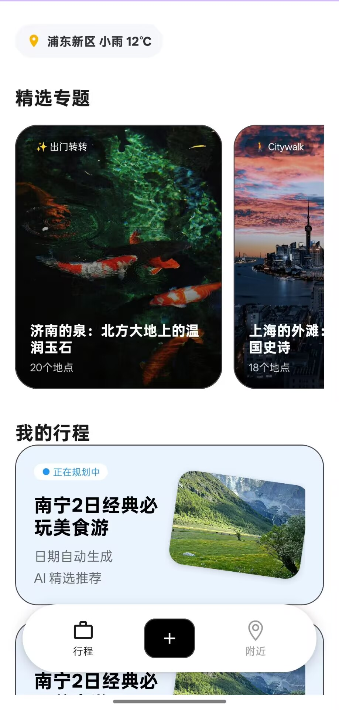
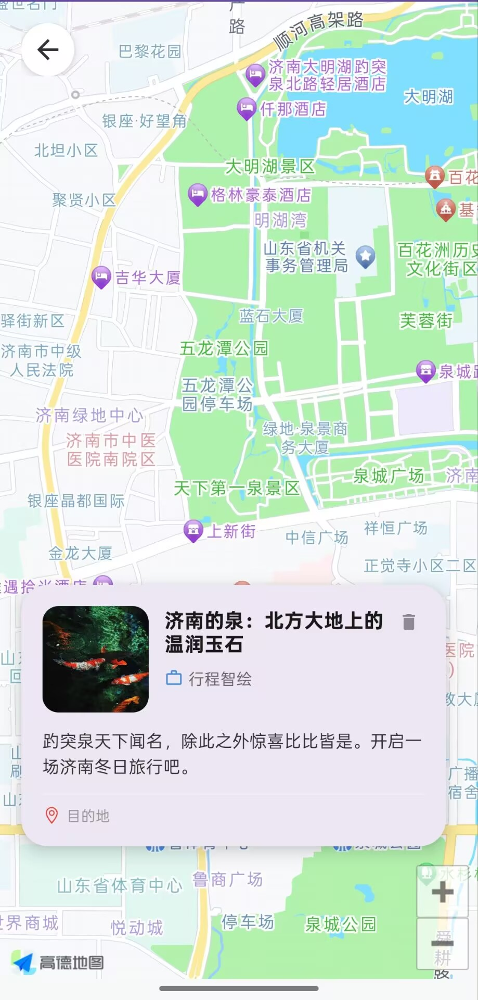
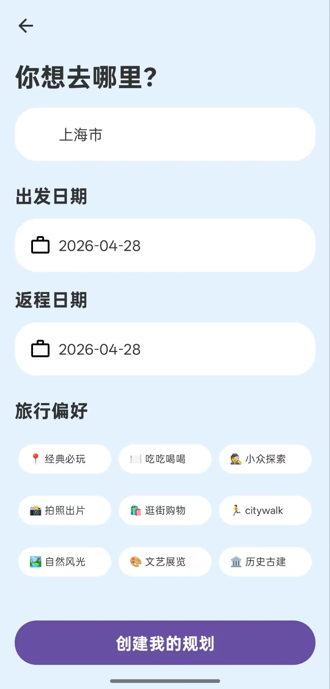
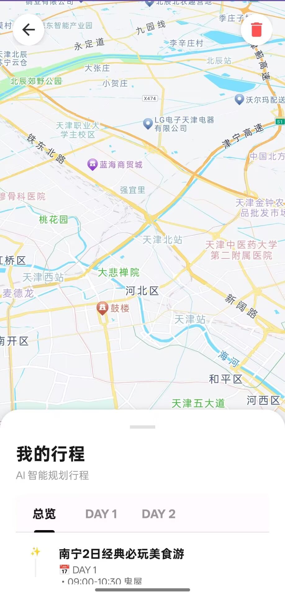

# 智能旅行行程规划 Android App

一个结合 **AI 行程生成、城市专题推荐、高德地图、天气定位和本地行程管理** 的 Android 旅行规划应用。

用户可以在 App 中选择想去的城市，填写出发日期、返回日期和旅行偏好，应用会请求后端 AI 服务生成每日旅行计划，并通过地图和行程面板进行展示。项目适合作为 Android 原生开发、AI 应用接入、地图服务集成类课程设计或个人作品展示。

## 项目核心定位

很多人在旅行前会遇到这些问题：

- 想去一座城市，但不知道哪些景点值得去
- 不知道每天路线该怎么安排
- 手动查攻略、查地图、查天气比较分散
- 做好的计划不方便统一保存和再次查看

本项目希望把这些流程集中到一个 App 中：

```text
选择目的地
  ↓
填写日期和偏好
  ↓
AI 生成旅行计划
  ↓
保存到我的行程
  ↓
在地图和详情页中查看
```

## 界面截图

> 下面截图展示了当前 App 的主要页面效果。  
> 如果图片暂时无法显示，请将截图上传到仓库的 `docs/images/` 目录，并使用下方对应文件名。

| 首页 | 地图专题页 |
| --- | --- |
|  |  |

| 创建行程页 | 行程详情页 |
| --- | --- |
|  |  |

## 界面效果说明

根据当前前端效果，应用主要包含以下几个核心界面。

### 1. 首页：精选专题 + 我的行程

首页上方展示当前位置天气信息，例如城市与温度。中间区域是「精选专题」，以横向卡片形式展示推荐城市和旅行主题，例如济南趵突泉、上海外滩、北京故宫、南京、武汉等。

首页下方是「我的行程」，展示用户已经保存过的旅行计划。底部导航栏包含：

- 行程入口
- 中间创建按钮
- 附近地图入口

这个页面的作用是让用户一打开 App 就能看到推荐目的地，也能快速继续查看自己保存过的旅行计划。

### 2. 地图专题页：景点地图 + 信息卡片

当用户点击首页的专题城市卡片后，会进入地图页面。

页面主体是高德地图，地图会定位到对应城市或景点区域。底部显示一个景点信息卡片，包含：

- 景点名称
- 推荐标签
- 图片缩略图
- 简短介绍

例如专题景点「济南趵突泉」会在地图上展示对应区域，并在底部卡片中显示景点介绍。这个界面让用户在查看推荐内容时，可以同时理解地理位置。

### 3. 创建行程页：目的地 + 日期 + 偏好

创建行程页采用清晰的表单布局，用户需要填写：

- 想去哪里
- 出发日期
- 返回日期
- 旅行偏好

旅行偏好以标签形式展示，例如自然风光、历史文化、美食、Citywalk 等。用户选择后点击「创建我的计划」，应用会把这些信息发送给后端 AI 行程规划接口。

这个页面是 AI 行程生成的入口，也是整个应用中最关键的用户输入流程。

### 4. 行程详情页：地图 + 每日计划

行程详情页上半部分为高德地图，下半部分为行程详情面板。

详情面板包含：

- 行程标题
- 行程概览
- DAY 1、DAY 2 等每日标签
- 每天的时间段、景点名称和推荐理由

用户可以切换不同天数查看每日安排。地图和文字行程结合，可以让旅行计划更直观。

## 主要功能

### AI 行程生成

用户填写目的地、旅行日期和偏好后，App 会调用后端接口生成行程计划。后端返回 JSON 数据，App 再解析并展示为可读的每日行程。

行程生成流程：

```text
CreateItineraryActivity
  ↓
PlanTravelRequest
  ↓
Retrofit 请求后端接口
  ↓
AI 返回行程 JSON
  ↓
AIResultActivity 展示结果
  ↓
保存到 SharedPreferences
```

### 城市和地点搜索

搜索功能结合了两部分数据：

- 本地 `city_list.json` 城市数据
- 高德地图 Inputtips 输入提示

用户输入关键词后，App 会显示相关城市或地点建议。点击搜索结果后可以直接进入创建行程页面。

### 高德地图展示

项目集成了高德地图能力，主要用于：

- 首页定位天气
- 附近地图展示
- 专题目的地定位
- 行程详情地图展示
- 城市名称转经纬度定位

地图相关页面主要包括：

- `NearbyActivity`
- `ItineraryDetailActivity`

### 天气信息展示

首页会请求定位权限，获取用户当前位置的行政区划编码，然后通过高德天气 Web API 获取实时天气。

天气信息会以胶囊样式展示在首页顶部，帮助用户快速了解当前位置天气状态。

### 行程本地保存

AI 生成后的行程可以保存到本地。当前使用 `SharedPreferences` 存储，保存内容包括：

- 行程 ID
- 行程标题
- 目标城市
- 原始 AI 返回 JSON

保存后的行程会显示在首页「我的行程」区域，用户可以再次进入详情页查看，也可以在详情页删除行程。

## 技术栈

| 分类 | 技术 |
| --- | --- |
| 开发语言 | Java |
| 应用类型 | Android 原生应用 |
| 构建方式 | Gradle Kotlin DSL |
| 最低版本 | Android 9.0, API 28 |
| 目标版本 | Android API 34 |
| UI 框架 | AndroidX AppCompat、Material Components、ConstraintLayout |
| 地图服务 | 高德 3D Map SDK、Search SDK、Location SDK |
| 网络请求 | Retrofit 2、OkHttp、Gson Converter |
| 数据格式 | JSON |
| 本地存储 | SharedPreferences |

## 项目结构

```text
.
├── app/
│   ├── libs/
│   │   └── AMap3DMap_10.1.600_AMapSearch_9.7.4_AMapLocation_6.5.1_20251020.aar
│   │
│   └── src/main/
│       ├── AndroidManifest.xml
│       ├── assets/
│       │   └── city_list.json
│       │
│       ├── java/com/example/myapplication/
│       │   ├── MainActivity.java
│       │   ├── SearchActivity.java
│       │   ├── CreateItineraryActivity.java
│       │   ├── AIResultActivity.java
│       │   ├── ItineraryDetailActivity.java
│       │   ├── NearbyActivity.java
│       │   ├── NewsActivity.java
│       │   ├── AddItineraryBottomSheet.java
│       │   ├── DayAdapter.java
│       │   ├── NodeAdapter.java
│       │   ├── DayItinerary.java
│       │   ├── TripNode.java
│       │   └── network/
│       │       ├── ApiService.java
│       │       ├── RetrofitClient.java
│       │       ├── PlanTravelRequest.java
│       │       └── PlanResponse.java
│       │
│       └── res/
│           ├── drawable/
│           ├── layout/
│           ├── menu/
│           ├── values/
│           └── xml/
│
├── build.gradle.kts
├── settings.gradle.kts
├── gradle.properties
└── README.md
```

## 关键页面与代码对应关系

| 页面 | 文件 | 作用 |
| --- | --- | --- |
| 首页 | `MainActivity.java` / `activity_main.xml` | 展示天气、精选专题、我的行程和底部导航 |
| 搜索页 | `SearchActivity.java` / `activity_search.xml` | 搜索城市或地点，进入创建行程流程 |
| 创建行程页 | `CreateItineraryActivity.java` / `activity_create_itinerary.xml` | 收集目的地、日期和偏好，请求 AI 生成计划 |
| AI 结果页 | `AIResultActivity.java` / `activity_ai_result.xml` | 展示 AI 生成结果，并保存行程 |
| 行程详情页 | `ItineraryDetailActivity.java` / `activity_itinerary_detail.xml` | 地图展示行程城市，并按天显示计划 |
| 附近地图页 | `NearbyActivity.java` / `activity_nearby.xml` | 展示当前位置或指定地点地图 |
| 资讯页 | `NewsActivity.java` / `activity_news.xml` | 预留旅行资讯页面 |

## 后端接口说明

AI 行程生成接口配置在：

```text
app/src/main/java/com/example/myapplication/network/RetrofitClient.java
```

接口声明在：

```text
app/src/main/java/com/example/myapplication/network/ApiService.java
```

当前接口路径：

```text
POST /api/v1/travel/plan
```

请求数据模型：

```text
PlanTravelRequest
├── location      目的地
├── start_date    出发日期
├── end_date      返回日期
├── days          旅行天数
└── preferences   旅行偏好
```

App 期望后端返回包含行程总览和每日行程的数据，主要解析字段包括：

```text
trip_overview
daily_itinerary
```

每日行程中建议包含：

```text
day
schedule
time_window
poi_name
reason
```

## 本地数据说明

### 城市数据

```text
app/src/main/assets/city_list.json
```

用于搜索页的本地城市匹配。

### 行程数据

用户保存的行程存储在：

```text
SharedPreferences: MyTravelPlans
```

保存格式为 JSON 数组，主要字段包括：

```text
id
title
city_name
content
```

## 权限说明

项目在 `AndroidManifest.xml` 中声明了以下权限：

| 权限 | 用途 |
| --- | --- |
| `INTERNET` | 请求天气、地图和 AI 后端接口 |
| `ACCESS_NETWORK_STATE` | 检查网络状态 |
| `ACCESS_WIFI_STATE` | 获取网络相关状态 |
| `ACCESS_FINE_LOCATION` | 获取精确定位 |
| `ACCESS_COARSE_LOCATION` | 获取粗略定位 |
| `READ_EXTERNAL_STORAGE` | 兼容旧版本资源读取 |
| `WRITE_EXTERNAL_STORAGE` | 兼容旧版本资源写入 |

## 运行方式

### 1. 克隆项目

```bash
git clone https://github.com/2327937233/Jankooo_code.git
cd Jankooo_code
```

### 2. 使用 Android Studio 打开

推荐环境：

- Android Studio Iguana 或更新版本
- JDK 17
- Android SDK Platform 34
- Gradle 可正常同步

### 3. 配置高德 Key

在 `AndroidManifest.xml` 中配置高德 Android Key：

```xml
<meta-data
    android:name="com.amap.api.v2.apikey"
    android:value="YOUR_AMAP_ANDROID_KEY" />
```

天气接口还需要高德 Web 服务 Key，当前位于 `MainActivity.java` 中。

公开上传到 GitHub 前，建议不要直接暴露真实 Key，可以改为：

- 使用 `local.properties`
- 使用后端代理接口
- 使用 Gradle BuildConfig 注入

### 4. 配置后端地址

在 `RetrofitClient.java` 中修改：

```java
private static final String BASE_URL = "YOUR_BACKEND_BASE_URL";
```

确保后端支持：

```text
POST /api/v1/travel/plan
```

### 5. 构建运行

Windows：

```bash
gradlew.bat assembleDebug
```

macOS / Linux：

```bash
./gradlew assembleDebug
```

也可以直接在 Android Studio 中点击 Run 运行到模拟器或真机。

## 项目特色

- 前端界面围绕真实旅行场景设计，首页、地图、表单和详情页结构清晰
- AI 行程生成流程完整，从输入偏好到展示结果再到保存行程
- 地图和行程结合，不只是文字攻略，而是可以看到目的地位置
- 使用 Material 风格控件，创建行程页表单简洁易理解
- 支持专题目的地推荐，适合作为旅行灵感入口
- 项目模块划分明确，便于继续扩展

## 可继续优化方向

- 修复部分中文字符串和注释的编码显示问题
- 将高德 Key 和后端地址从源码中移出，提升安全性
- 使用 Room 数据库存储行程，替代 `SharedPreferences`
- 增加用户登录和云端同步能力
- 增加路线规划、交通方式、预算估算等功能
- 优化 AI 返回内容的容错解析
- 为网络请求和 JSON 解析增加单元测试
- 增加真实界面截图到 README 中，提升 GitHub 展示效果

## 适用场景

本项目适合用于：

- Android 课程设计
- 移动应用开发练习
- AI 应用接入案例
- 地图服务集成案例
- 个人 GitHub 项目展示
- 毕业设计原型项目

## License

本项目当前主要用于学习和作品展示。如需正式开源，可以根据实际需求补充 MIT、Apache-2.0 或其他开源协议。
